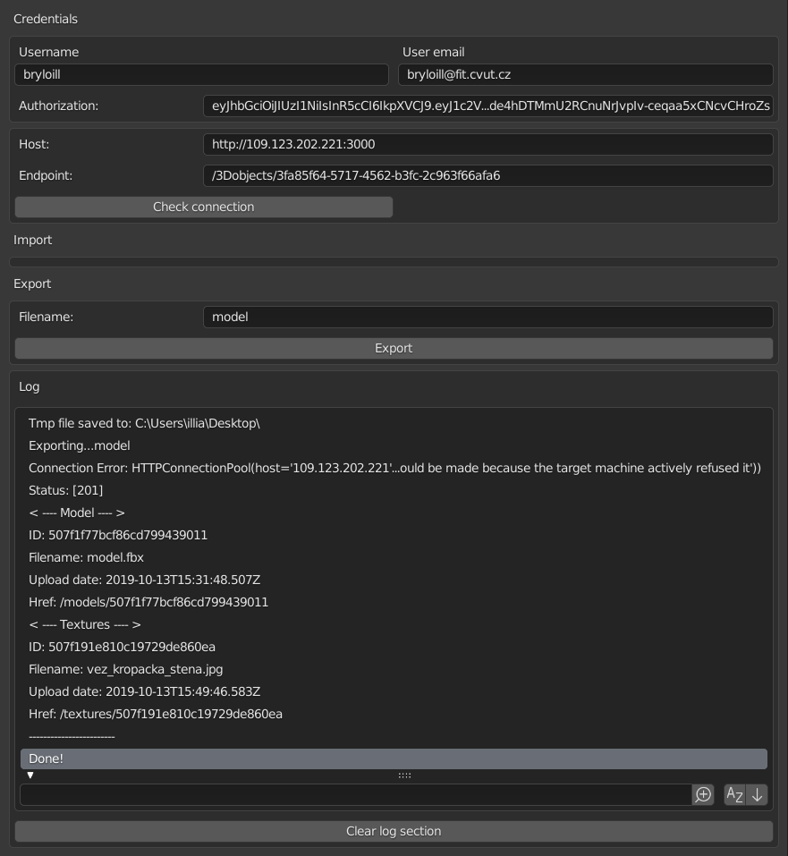

= blender-rest-api-exporter

Export to RESTfull API add-on for Blender. You can use this add-on to make faster the process of sending 3D models to your server, after they've been created or modified. You have a possibility to export the whole scene collection in different file formats. Currently they are .blend, .fbx, .obj, .gltf. Add-on creates tmp 3D model file in the format you've choosed, then sends it to the server. Also it sends the model textures to the server (.png and .jpg files from "textures" folder in the project root)After receiving a response, add log with a response status and shows the response content if possible. Also this add-on can be used with authorized requests. By default it uses Bearer token (you have to fill Authorization field without Bearer prefix) to send your request with authorization header added.
This add-on has to be a part of VMCK project. **Expired by: xref:https://kralovskavennamesta.cz/vystupy2019/dokumentace_exportni_system_2019.pdf[]**

IMPORTANT: Under development. Tested on WIN10, Blender 2.90.1

IMPORTANT: Import section is under development (VMCK only)

TIP: Request body meets VMCK API requirements. You can change it in **system.export** operator

=== Short user manual:

.Instalation:
. Required version of Blender is 2.90.1
. Go to `Edit` > `Preferences` > `Add-ons` > `Install`
. Find the export_to_api.py file
. Click `Install Add-on`
. Then find `Import-Export: Export to API` in the Add-on list and enable it

image::./doc/install.png[align="center"]

IMPORTANT: You will find the add-on panel in the `Object Properties`. It will be called **Export to API**

image::./doc/full_screen.png[align="center"]

IMPORTANT: Save your project before Export!

.Simple usage wihout authorization:
. Find **Export to API** panel in the `Object Properties`
. Enter the host
. Click the `Check connection`
. Enter the endpoint
. Enter the file name
. Click `Export`
. Choose preferable file format
. Wait for the response. Response status and response body (if showable) will be logged in the Log section. Also you can find info the Blender console

image::./doc/clear_ui.png[align="center"]

.UI elements:
* `Username`: your username, which can be added to request body or headers. **Not used by default**
* `User email`: your email, which can be added to request body or headers. **Not used by default**
* `Authorization`: field to enter the auth token if needed. **By default is Bearer token**.  Just enter your token without "Bearer" prefix
* `Host`: hostname of the server, where the request will be sent. **Has to start with "http://" or "https://"**
* `Endpoint`: request endpoint. **Check your API docs**
* `Check connection` button: after been clicked, add-on will check, if there are any responses from the server. **Check the result in Log section**
* `File name`: file to export will have this name. **Has not to be empty**
* `Export` button: sending a request to an endpoint with the 3D model file. You will choose the file format first. File will be added to Request body
* `Log section`: place for logs and messages
* `Clear log section` button: will remove all logs in the Log section

=== Example of exporting process:

**(VMCK server is currently unreachable)**

After clicking the `Check connection` button. Checking the connection with the VMCK server

After exporting to VMCK server. Server response is hardcoded. Log based on response. Print the info from the server about
the model and all model textures

Choosing the file format after clicking `Export` button

Logging the exporting process after `Export` button been clicked

image::./doc/after_export.png[align="center"]

After clicking the `Check connection` button if there were any responses, the response status added as log

image::./doc/suc_connection.png[align="center"]

Log info, when the host name has invalid format

image::./doc/log_info.png[align="center"]

Log error, when trying to export the file with an empty filename

image::./doc/empty_filename.png[align="center"]

== VMCK export:

.VMCK manual:
. Enter the host
. Enter the Bearer token without "Bearer" prefix
. Enter the endpoint
. Enter the file name
. Click `Export`
. Choose preferable file format
. Wait for the response
. Info about the exported model and textures will appear in Log, some info also can be in Blender console

- Save all textures to "textures" folder in the project root. Dont create other folders in "textures" folder. Add-on exports textures only from first dir level. Textures has to be .jpg or .png files

- Exporting .obj file creates additional .mtl file, which will be in "assets"

== Advanced section:

Add-on source code contains some parts that it doesn't use currently, but which can be very usefull when adding different additional features to it. F.e. it's operators to send different HTTP request and Request-Response property groups. At this moment only **system.do_request** and **system.do_get_request** operators are used when calling **system.check_connection**. **system.do_request** is an entry part to call each HTTP request

Also the Import section is under development. This section can be used only with VMCK server. It will add additional features as importing files from the server and working with different versions of them

**system.export** operator fills the request body to the dictionary in the format VMCK API requires. You can change it directly to meet your own needs  

== Some interesting parts:

### Export operator

[source,python]
----
    # ----------------- Start: Export (VMCK requirements) ----------------- #

"""
    Implementing the Export of the 3D model in different file formats with textures to VMCK server.
    To do Export you should have save the project and and store your textures in "textures" folder in the project 
    root. Supported textures are in png and jpg format. All textures has to be in that folder in the same dir level. No
    deeper levels are allowed.
    
    Currently it's not possible to communicate with the server, so the response is hardcoded to show the response 
    logging process
"""

class Export(bpy.types.Operator):
    """
        Export class exports 3D models in different formats with their textures to the VMCK server
    """

    bl_idname = "system.export"
    bl_label = "Export"

    # invokes the dialog with the user to choose the file format
    def invoke(self, context, event):
        return context.window_manager.invoke_props_dialog(self, width=300)

    # file format dialog
    def draw(self, context):
        layout = self.layout
        layout.prop(context.scene, "file_format")

    def execute(self, context):

        # checking the file name
        if bpy.context.scene.filename is "":
            bpy.ops.log.add(log=FILENAME_EMPTY_MESSAGE)
            return {'FINISHED'}

        # ------------------------------------------ #
        """
            Uncomment when the server will be up
        """

        # # checking the connection with the server
        # bpy.ops.system.check_connection()
        #
        # # if it's not possible to connect stops export
        # if not bpy.context.scene.Response.successful:
        #     return {'FINISHED'}
        # else:
        #     bpy.ops.log.clear()

        # ------------------------------------------ #

        # getting the project dir path
        dir = bpy.path.abspath("//")

        # preparing the 3D model file info
        file_format = context.scene.file_format + ".glb" \
            if context.scene.file_format == "GLTF" else context.scene.file_format

        # filename from the filename field
        filename = context.scene.filename

        # creating the filepath to save file to export
        filepath = bpy.path.abspath("//" + filename + "." + file_format.lower())

        # filling textures array with textures files names from textures folder in the project root
        textures = \
            [f for f in os.listdir(bpy.path.abspath("//" + "textures")) if f.endswith(".png") or f.endswith(".jpg")] \
                if os.path.exists(bpy.path.abspath("//" + "textures")) else []

        # saving the file to export using Blender Operators
        if file_format == 'OBJ':
            bpy.ops.export_scene.obj(filepath=filepath)
        elif file_format == 'FBX':
            bpy.ops.export_scene.fbx(filepath=filepath)
        elif file_format == 'BLEND':
            bpy.ops.wm.save_mainfile(filepath=filepath)
        elif file_format == 'GLTF':
            bpy.ops.export_scene.gltf(filepath=filepath)

        bpy.ops.log.add(log="Tmp file saved to: " + dir)
        bpy.ops.log.add(log="Exporting..." + filename)

        # setting up request variables
        endpoint = context.scene.APIData.host + context.scene.Request.endpoint
        headers = {'Authorization': "Bearer " + context.scene.APIData.user.authorization}

        # model to export
        files = {
            'name': filename,
            'model': (filename, open(filepath, 'rb'), 'multipart/form-data')
        }

        if file_format == 'OBJ':
            mtl_file_obj_filepath = dir + filename + ".mtl"
            files.update({'assets': (filename + ".mtl", open(mtl_file_obj_filepath), 'multipart/form-data')})

        # filling files dictionary with model textures if there is any
        if textures is not []:
            for key, texture in enumerate(textures):
                files.update({f'textures[{key}]': (texture,
                                                   open(bpy.path.abspath("//" + "textures/" + texture), 'rb'),
                                                   'multipart/form-data'
                                                   )
                              })

        context.scene.Response.successful = False
        response = None

        # sending POST request
        try:
            response = requests.post(endpoint, headers=headers, files=files, timeout=TIMEOUT)
            context.scene.Response.successful = True
        except requests.exceptions.HTTPError as httperr:
            print(HTTP_ERROR_MESSAGE, httperr)
            bpy.ops.log.add(log=HTTP_ERROR_MESSAGE + str(httperr))
        except requests.exceptions.ConnectionError as conerr:
            print(CONNECTION_ERROR_MESSAGE, conerr)
            bpy.ops.log.add(log=CONNECTION_ERROR_MESSAGE + str(conerr))
        except requests.exceptions.Timeout as tmterr:
            print(TIMEOUT_ERROR_MESSAGE, tmterr)
            bpy.ops.log.add(log=TIMEOUT_ERROR_MESSAGE + str(tmterr))
        except requests.exceptions.RequestException as error:
            print(UNKNOWN_ERROR_MESSAGE, error)
            bpy.ops.log.add(log=UNKNOWN_ERROR_MESSAGE + str(error))

        response_content = {}
        if response:
            bpy.ops.log.add(log="Status: " + f"[{str(response.status_code)}]")
            response_content = dict(response.content)

        # -------- Hard coded response ------------------------- #

        response_content = {
            "id": "3fa85f64-5717-4562-b3fc-2c963f66afa6",
            "structureId": "3fa85f64-5717-4562-b3fc-2c963f66afa6",
            "name": "Věž Kropáčka",
            "transformation": [
                [1, 2, 3],
                [4, 5, 6],
                [7, 8, 9]
            ],
            "createdDate": "2020-12-11T17:39:25.826Z",
            "model": {
                "id": "507f1f77bcf86cd799439011",
                "filename": filename + "." + file_format.lower(),
                "uploadDate": "2019-10-13T15:31:48.507Z",
                "href": "/models/507f1f77bcf86cd799439011"
            },
            "textures": [
                {
                    "id": "507f191e810c19729de860ea",
                    "filename": "vez_kropacka_stena.jpg",
                    "uploadDate": "2019-10-13T15:49:46.583Z",
                    "href": "/textures/507f191e810c19729de860ea"
                }
            ],
            "properties": [
                {
                    "weather": "rain20"
                }
            ],
            "status": "preparing",
            "assets": [
                {
                    "id": "54759eb3c090d83494e2d804",
                    "filename": "vez_kropacka.sfa",
                    "uploadDate": "2019-10-13T15:52:16.704Z",
                    "href": "/assets/54759eb3c090d83494e2d804"
                }
            ],
            "version": "1.15.3",
            "href": "/3DObjects/3fa85f64/0.15.3"
        }

        # --------------------------------------------------- #

        # logging the response to Log
        bpy.ops.log.add(log="Status: " + "[201]")

        # info about saved model
        bpy.ops.log.add(log="< ---- Model ---- >")
        bpy.ops.log.add(log="ID: " + response_content['model']['id'])
        bpy.ops.log.add(log="Filename: " + response_content['model']['filename'])
        bpy.ops.log.add(log="Upload date: " + response_content['model']['uploadDate'])
        bpy.ops.log.add(log="Href: " + response_content['model']['href'])

        # info about model textures
        bpy.ops.log.add(log="< ---- Textures ---- >")
        for texture in response_content['textures']:
            bpy.ops.log.add(log="ID: " + texture['id'])
            bpy.ops.log.add(log="Filename: " + texture['filename'])
            bpy.ops.log.add(log="Upload date: " + texture['uploadDate'])
            bpy.ops.log.add(log="Href: " + texture['href'])
            bpy.ops.log.add(log="------------------------")

        bpy.ops.log.add(log="Done!")

        return {'FINISHED'}

# ----------------- Start: Export (VMCK requirements) ----------------- #
----

#### DoRequest operator

DoRequest operator calls different HTTP request operators

[source,python]
----
    class DoRequest(bpy.types.Operator):
    """
        Class DoRequest manages to call other HTTP requests operators, using Blender Operator
    """

    bl_idname = "system.do_request"
    bl_label = "API request operator"

    def execute(self, context):
        """
            Function to prepare the calling of HTTP request operator by filling it with data from scene Request property
        """

        # HTTP request method to call
        method = bpy.context.scene.Request.method

        # setting up request headers
        headers = {}
        if bpy.context.scene.Request.headers is not "":
            headers = json.loads(bpy.context.scene.Request.headers)

        # adding User authorization to request headers
        headers.update({'Authorization': "Bearer " + context.scene.APIData.user.authorization})
        bpy.context.scene.Request.headers = json.dumps(headers)

        # setting up request payload
        payload = {}
        if bpy.context.scene.Request.payload.body is not "":
            payload = json.loads(bpy.context.scene.Request.payload.body)

        bpy.context.scene.Request.payload.body = json.dumps(payload)

        # checking if the Request method is valid
        if method not in {'GET', 'POST', 'PUT', 'DELETE'}:
            bpy.ops.log.add(log=f"Error: Request method is invalid: {method}")
            return {'FINISHED'}

        # checking if the hostname is correct
        if not context.scene.APIData.host.startswith("https://") \
                and not context.scene.APIData.host.startswith("http://"):
            bpy.ops.log.add(log=INVALID_HOST_MESSAGE)
            return {'FINISHED'}

        # creating the operator call string as f.e. "bpy.ops.system.do_get_request"
        method_call = "bpy.ops.system.do_" + method.lower() + "_request()"

        # calling operator
        eval(method_call)
        response = bpy.context.scene.Response

        # emptying Request scene property before next possible usage
        bpy.context.scene.Request.method = ""
        bpy.context.scene.Request.headers = ""
        bpy.context.scene.Request.payload.body = ""
        bpy.context.scene.Request.endpoint = ""

        # if not successful - exit
        if not response.successful:
            return {'FINISHED'}

        # logging info about the response to Log
        bpy.ops.log.add(log="Status: " + response.status)
        bpy.ops.log.add(log="Headers: " + response.headers)
        bpy.ops.log.add(log="Body: " + response.payload.body)

        return {'FINISHED'}

----

#### Logger

Log section implementation

[source,python]
----
    # ----------------- Start: Log section ----------------- #

"""
Classes to create and manage Log section
"""

class Log(bpy.types.PropertyGroup):
    """
        Log class of Log section, using Blender Property Group

        log : string
            One log in log section
    """

    log: bpy.props.StringProperty(name="")

class LogGroup(bpy.types.PropertyGroup):
    """
        LogGroup class helps to manage Log section, using Blender Property Group
    """

    coll: bpy.props.CollectionProperty(type=Log)
    index: bpy.props.IntProperty()

class LogList(bpy.types.UIList):
    """
        LogList class defines the look of Log section, using Blender UI List
    """

    bl_idname = "LOGLIST_UL_log_list"

    def draw_item(self, context, layout, data, item, icon, active_data, active_property, index=0, flt_flag=0):
        layout.prop(item, "log", emboss=False)

class AddLog(bpy.types.Operator):
    """
        AddLog class adds log to Log section, using Blender Operator
    """

    bl_idname = "log.add"
    bl_label = "Add log to log section"

    log: bpy.props.StringProperty(default="OBJECT")

    def execute(self, context):
        item = context.scene.LogGroup.coll.add()
        item.log = self.log
        context.scene.LogGroup.coll.move(len(context.scene.LogGroup.coll.items()) + 1, 0)
        return {'FINISHED'}

class ClearLogList(bpy.types.Operator):
    """
        ClearLogList class clears Log sections, using Blender Operator
    """

    bl_idname = "log.clear"
    bl_label = "Clear log section"

    def execute(self, context):
        context.scene.LogGroup.coll.clear()
        return {'FINISHED'}

# ----------------- End: Log section ----------------- #

----

#### User and APIData property group classes

Property groups to store data about the User and API. May be used for adding additional features to the add-on

[source,python]
----
    # ----------------- Start: Helpers ----------------- #

"""
Classes to store data about the User and API. 
May be used for adding additional features to the add-on
"""

class Payload(bpy.types.PropertyGroup):
    """
        Payload class to store Request or Response body, using Blender Property Group
        Can be used if you want to send some data as data= argument in POST and PUT requests, that can be transformed from
        string back to dictionary using json.loads()

        body : string
            Request body as string
    """

    body: bpy.props.StringProperty()

class Request(bpy.types.PropertyGroup):
    """
        Request class to store information about HTTP request, using Blender Property Group

        method : string
            HTTP request method as uppercase string
        endpoint : string
            Request endpoint - part after hostname as "/*"
        headers : string
            Headers of HTTP request as string which can be transformed to dictionary using json.loads()
        payload : Payload
            Object of Payload class
    """

    method: bpy.props.StringProperty()
    endpoint: bpy.props.StringProperty(
        name="Endpoint",
        description="API endpoint",
        default=""
    )
    headers: bpy.props.StringProperty()
    payload: bpy.props.PointerProperty(type=Payload)

class Response(bpy.types.PropertyGroup):
    """
        Response class to store information of HTTP response, using Blender Property Group

        successful : bool
            True - if Request was successful, False - otherwise
        status : string
            HTTP response code as "[code]"
        headers : string
            Headers of HTTP as string which can be transformed back to dictionary using json.loads()
        payload : Payload
            Object of Payload class
    """

    successful: bpy.props.BoolProperty()
    status: bpy.props.StringProperty()
    headers: bpy.props.StringProperty()
    payload: bpy.props.PointerProperty(type=Payload)

class User(bpy.types.PropertyGroup):
    """
        User class to store credentials of API user

        username : string
            User username
        user_email : string
            User email
        authorization : string
            User authorization header as string, which can be transformed to dictionary using json.loads()
    """

    username: bpy.props.StringProperty(
        name="Username",
        description="User username",
        default=""
    )
    user_email: bpy.props.StringProperty(
        name="User email",
        description="User email",
        default=""
    )
    authorization: bpy.props.StringProperty(
        name="Authorization",
        description="User authorization",
        default=""
    )

class APIData(bpy.types.PropertyGroup):
    """
        APIData class stores information about API and it's user, using Blender Property Group

        host : string
            hostname of the server
        user : User
            User object
    """

    host: bpy.props.StringProperty(
        name="Host",
        description="Host address",
        default=""
    )
    user: bpy.props.PointerProperty(type=User)

# ----------------- End: Helpers ----------------- #

----

=== Author:
Illia Brylov @ArtXOS
